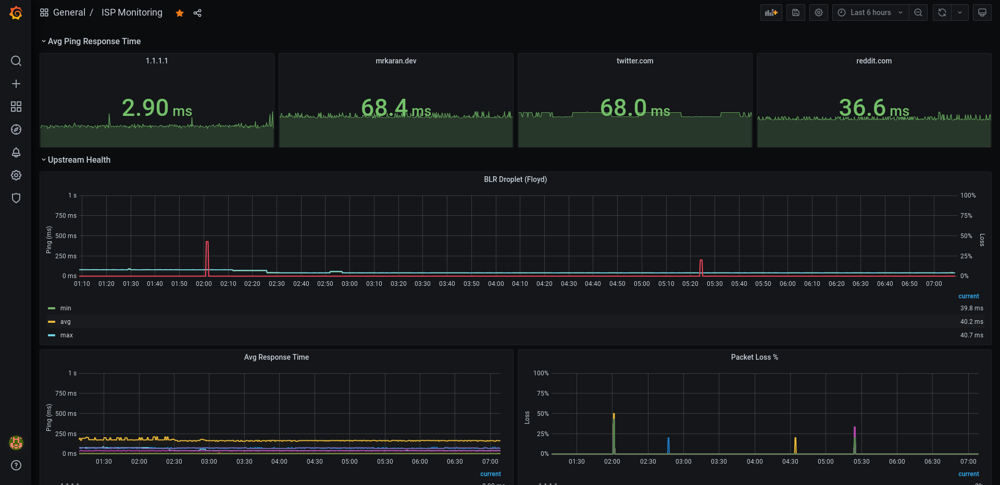
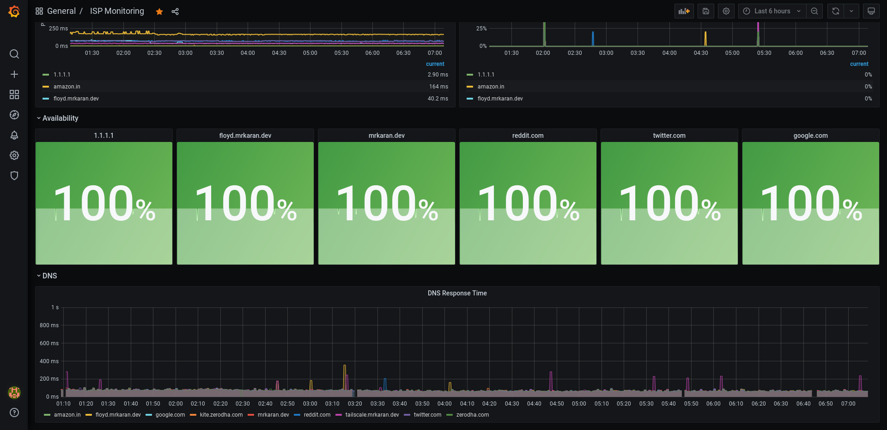

<!-- _class: lead -->

# Self Hosting 101

FOSS United - April 2021

*@mrkaran*

---

# `whoami`

👨‍💻 Writes YAML at Zerodha

📈 Interested in Monitoring and Observability systems

📓 Blogs about things I find interesting

🧩 **Self hosted enthusiast**

---

# Why (I) Self Host

- Break from the Big Tech Co

---

# Why (I) Self Host

- Break from the Big Tech Co
- Own your data

---

# Why (I) Self Host

- Break from the Big Tech Co
- Own your data
- No lock ins for data which is critical

---

# Why (I) Self Host

- Break from the Big Tech Co
- Own your data
- No lock ins for data which is critical
- Chance to contribute to OSS

---

# Why (I) Self Host

- Break from the Big Tech Co
- Own your data
- No lock ins for data which is critical
- Chance to contribute to OSS
- Experiment and learn

---

# My Setup

## Servers

- DigitalOcean Droplet (2vCPU, 4GB RAM, blr1 Region)
- 1 * RPi 4 Node (4GB RAM)
- 1 * RPi 4 Node (2GB RAM)

---

# Infra and Deployments

- Ansible
- Terraform
- Nomad + Consul

---

## Ansible

- Boostrap the server
    - Harden SSH. User, Shell setups.
    - Install `node-exporter`, `docker`, `tailscale`.

---

## Terraform

- DigitalOcean infra
    - Droplet
    - Firewalls
    - SSH Keys, Volumes, Floating IPs etc.

- Cloudflare DNS
    - `mrkaran.dev` hosted zone
    - DNS Records in ^ the zone.

---

## Nomad + Consul

- Single node cluster.
- Runs every workload (mostly) as a docker container.

---

# Services I run

- Pi-hole
- Gitea
- Joplin Sync Server
- Shynet
- Firefly III
- Nextcloud
- `doggo` (Shameless self plug)

---

# Monitoring

- Grafana
- Prometheus
- Telegraf to collect home ISP stats
    - Ping Input plugin
    - DNS Input Plugin

---

---

---

# Networking

- Tailscale for Mesh Network
    - Based on Wireguard VPN.
    - Authenticated sessions only.
    - Expose services on RPi easily without any static IP.

---

# Networking

- Caddy as a proxy for all services.
    - Running 2 instances of Caddy.
        - Private: Listens on Tailscale Interface.
        - Public: Listens on DO's public IPv4 Interface.

    - Automatic SSL with ACME DNS challenge
        - Built my own image: https://github.com/mr-karan/caddy-plugins-docker

---

# Storage

- DONT use RPi for storage.
    - Atleast not with SD cards.
    - Newer RPis can boot off SSDs.

- Enable snapshots for volumes provided by cloud provider.

- Use separate DB instances for different applications.

---

# Backups

- Restic
    - Periodic Job in Nomad.
    - Single vault with everything inside `/data`.
    - All applications mount inside `/data` folder.
    - Upload to Backblaze B2.

---

# Security

- If it should not be public facing, don't expose to WWW.
    - Prefer to use a VPN or mesh network instead of IP whitelists.
    - Tighter Firewall rules otherwise.

- Pi-Hole, Gitea, etc Admin interfaces must always be protected with strong passwords.
    - Wonder how many `admin/admin` Grafana instances are out in open.
    - Or worse, no auth. Looking at you Elasticsearch.

- Periodic **updates** to App and OS.

---

# Takeaways

- Don't overthink. Pick something really simple (like Pi-hole) and host it.
    - You'll feel pretty happy about it.

- Don't blindly copy/paste this stack.
    - Took me 2 years of constant iteration and experimentation.
    - KISS.

---

# Resources

[r/selfhosted](https://www.reddit.com/r/selfhosted)
    - Incredible, beginner friendly wiki: https://wiki.r-selfhosted.com/
[github.com/awesome-selfhosted](https://github.com/awesome-selfhosted/awesome-selfhosted)

---

<!-- _class: lead -->

# Thank You

## Questions?
